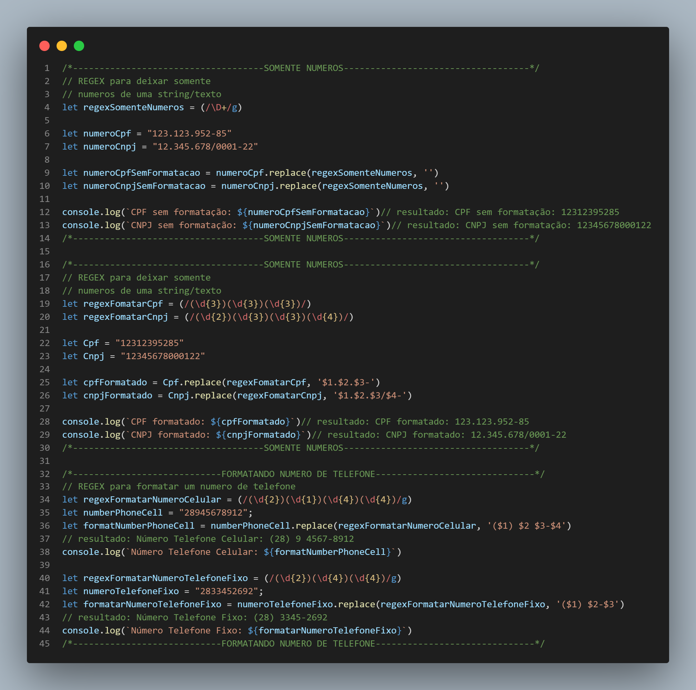

#  Expressões Regulares JavaScript

Expressões regulares são padrões utilizados para selecionar combinações de caracteres em uma string.

#   O que foi feito nesse projeto

Para que eu conseguisse formatar os dados da string, usei o `replace`.

- Retirando a formatação do CPF/CNPJ, deixando somente os números

- Formatando o CPF/CNPJ, deixando dentro da fomatação que usamos no Brasil `CPF: 123.654.569.-95` e `CNPJ: 12.623.623/0001-95`

- Formatando o TELEFONE CELULAR, `(28) 9 2356-9582`

- Formatando o TELEFONE FIXO, `(28) 2356-9582`

<!-- 

 -->

<h1 align="center">💻 Desenvolvido Por: Gilberto Júnior</h1>